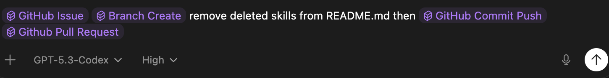

```text
   ____ ___ _____ _   _ _   _ ____    ____  _  _____ _     _     ____
  / ___|_ _|_   _| | | | | | | __ )  / ___|| |/ /_ _| |   | |   / ___|
 | |  _ | |  | | | |_| | | | |  _ \  \___ \| ' / | || |   | |   \___ \
 | |_| || |  | | |  _  | |_| | |_) |  ___) | . \ | || |___| |___ ___) |
  \____|___| |_| |_| |_|\___/|____/  |____/|_|\_\___|_____|_____|____/
```

# Agent GitHub Skills

High-leverage GitHub skill workflows for AI agents that turn recurring issue, triage, and PR operations into fast, consistent execution.



## Works With

OpenAI Codex, Claude Code, Cursor, Gemini CLI, GitHub Copilot, OpenCode, Cline, Windsurf, Roo Code.

Also supports any other agent platform supported by the `skills` ecosystem via [skills.sh](https://skills.sh) and the official [supported agent matrix](https://raw.githubusercontent.com/vercel-labs/skills/main/README.md).

## Skills

### GitHub Pull Request
Use when the user asks to create a pull request. Build a complete PR using best-practice structure with rich details on changes, verification, QA evidence, risks, and rollout notes. Include issue linkage and clear testing commands/results in the PR body. Skill file: [skills/github-pull-request/SKILL.md](skills/github-pull-request/SKILL.md).
```bash
npx skills add Mindgames/skills@github-pull-request -g
```

### GitHub Pull Request Review and Resolve
Deeply audit a GitHub pull request, analyze review comments and threads, apply legitimate fixes, resolve addressed review threads, and repair failing CI/build checks. Use when asked to handle PR review feedback, close out reviewer comments, or fix failing PR checks before merge. Skill file: [skills/github-pull-request-review-resolve/SKILL.md](skills/github-pull-request-review-resolve/SKILL.md).
```bash
npx skills add Mindgames/skills@github-pull-request-review-resolve -g
```

### GitHub Issues Audit and Labeling
Scan open GitHub issues and label those suitable for autonomous Agent execution with `Agent`; flag unclear candidates with `Needs-Spec`, enforce milestone alignment, and surface project/milestone-cycle planning gaps. Skill file: [skills/github-label-agent-issues/SKILL.md](skills/github-label-agent-issues/SKILL.md).
```bash
npx skills add Mindgames/skills@github-label-agent-issues -g
```

### GitHub Process Agent Issues
Sweep GitHub issues labeled Agent across local repositories and process each as a dedicated PR with deterministic status labels and comments. Skill file: [skills/github-process-agent-issues/SKILL.md](skills/github-process-agent-issues/SKILL.md).
```bash
npx skills add Mindgames/skills@github-process-agent-issues -g
```

### Branch Create
Use when a user asks to create a new local git branch and start issue work (for example, "create branch" or "start working on issue XYZ"). Use this for issue-based branch naming in the `type/scope-short-description` pattern and for always syncing local `main` from `origin/main` before creating the new branch, creating the local tracking `main` branch first when needed. Skill file: [skills/branch/SKILL.md](skills/branch/SKILL.md).
```bash
npx skills add Mindgames/skills@branch -g
```

### GitHub Issue
Create complete, implementation-ready GitHub issues from user input and publish them with `gh issue create`. Use when asked to create/file/open a new issue in any repository, including cases where requirements must be structured into clear scope, acceptance criteria, constraints, and done-when outcomes. Skill file: [skills/github-issue/SKILL.md](skills/github-issue/SKILL.md).
```bash
npx skills add Mindgames/skills@github-issue -g
```

### Project GitHub Issues
Create and manage GitHub issues for a multi-repo project, including milestones, project board linking, and sub-issues. Skill file: [skills/project-github-issues/SKILL.md](skills/project-github-issues/SKILL.md).
```bash
npx skills add Mindgames/skills@project-github-issues -g
```

### GitHub Milestone Cycle Ops
Plan and run milestone/cycle operations for multi-repo projects in GitHub with a shared milestone per project. Use when defining or revising current/next milestones, deciding cycle load, shaping backlog into AI-ready issues, creating/updating milestones and issues across repos, reviewing GitHub project board health, or producing daily/weekly project execution plans. Skill file: [skills/github-milestone-cycle-ops/SKILL.md](skills/github-milestone-cycle-ops/SKILL.md).
```bash
npx skills add Mindgames/skills@github-milestone-cycle-ops -g
```

### GitHub Sync
Sync a local Git repository with its remote safely. Use when an agent needs to update a repo before starting work, fast-forward a local branch from `origin`, confirm that local `main` or another branch matches the remote, or prepare an up-to-date base branch before creating a new branch. Skill file: [skills/github-sync/SKILL.md](skills/github-sync/SKILL.md).
```bash
npx skills add Mindgames/skills@github-sync -g
```

### Commit Push
Run lint/build checks before committing and pushing code, then optionally create a PR via GitHub CLI. Use when a user asks to commit/push changes or requests a pre-push verification workflow. Skill file: [skills/github-commit-push/SKILL.md](skills/github-commit-push/SKILL.md).
```bash
npx skills add Mindgames/skills@github-commit-push -g
```

### GitHub Pull Request Audit and Review
Perform a full local audit of one or more GitHub PRs, run repository-native deterministic checks, apply result labels, and post a structured review comment. Use when a PR in this repo or under projects/* needs a deep, evidence-based review across any language or stack. Skill file: [skills/gh-pr-audit/SKILL.md](skills/gh-pr-audit/SKILL.md).
```bash
npx skills add Mindgames/skills@gh-pr-audit -g
```
